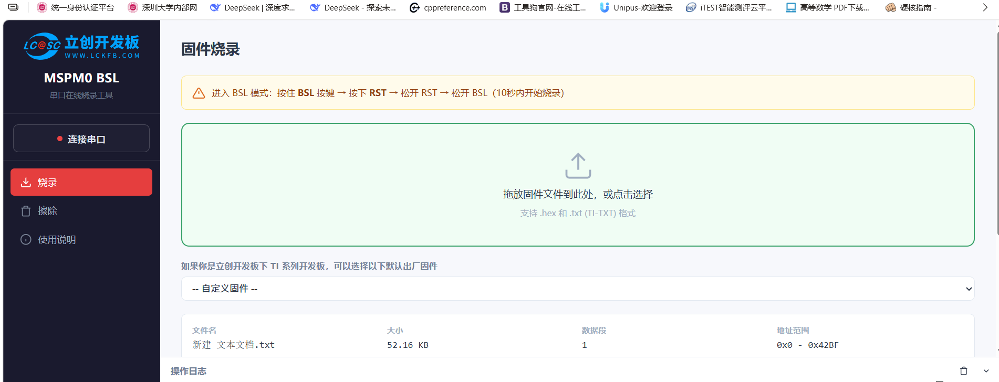
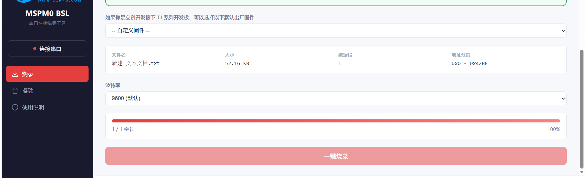

# MSPM0G3507 云台测试版固件烧录教程

本目录保存云台项目的测试版固件，以及使用嘉立创 MSPM0 BSL 网页工具烧录该固件的操作说明。

固件运行后的日志查看方法见 [`VS Code 串口调试教程（115200）`](串口调试教程.md)。注意：网页 BSL 烧录使用默认 9600，运行时串口调试使用 115200。

> **重要：这是测试版本。** 烧录前请确认目标板为对应的 MSPM0G3507 云台控制板。首次上电测试时应断开激光或关闭激光电源，并留出云台运动空间，避免电机突然转动造成夹伤、碰撞或激光误照。

## 1. 本次固件

| 项目 | 内容 |
| --- | --- |
| 固件文件 | [`MSPM0G3507_云台测试版固件_20260719_TI-TXT.txt`](MSPM0G3507_云台测试版固件_20260719_TI-TXT.txt) |
| 用途 | 云台功能测试版本 |
| 文件格式 | TI-TXT 文本固件 |
| 文件大小 | 55,593 字节（磁盘文件大小） |
| 固件数据量 | 17,784 字节 |
| 地址范围 | `0x0000–0x457F` |
| TI-TXT 地址标记 | 2 个：`@0000`、`@3D90` |
| SHA-256 | `9907EA83B51455283AC0B7A67A973E3BF673720EF90D457B4D244773420CFEAC` |

固件由原文件 `新建 文本文档.txt` 重命名归档，内容未修改。文件已经过结构检查：以 TI-TXT 地址标记开始，以 `q` 结束，未发现非法数据字符。

### 配套 K230 USART 通信修复代码

本目录同时提供配套脚本 [`K230_main_CHANGE_20260719_07.py`](K230_main_CHANGE_20260719_07.py)，SHA-256 为 `696BF04EC71C7FCFB8F4F5E6FC8435FB916F21AA2A8F68D67B13E83CB521F100`。

该版本解决 K230 与舵机云台之间的直接 USART/UART 通信问题，主要调整如下：

- 使用 Yahboom K230 模块 EXPORT 座对应的 `UART1`。
- 将 `IO9` 明确配置为 `UART1_TXD`，并设置输出使能。
- 将 `IO10` 明确配置为 `UART1_RXD`，并设置输入使能。
- 通信参数为 `115200 bit/s`、8 数据位、无校验、1 停止位（8N1）。
- 保持控制帧协议兼容，锁定时发送坐标误差，丢靶时发送 `+999/+999` 标记。

> `K230_main_CHANGE_20260719_07.py` 应复制到 K230/CanMV 环境中运行，不能把 `.py` 文件上传到 MSPM0 网页烧录器。网页烧录器只选择上表中的 MSPM0 `.txt` TI-TXT 固件。

## 2. 所需条件

- 一台待烧录的 MSPM0 开发板或云台控制板。
- 一根能够传输数据的 USB 线；仅支持充电的 USB 线无法连接串口。
- Chrome 89+ 或 Edge 89+。网页工具使用 Web Serial API，不建议使用不支持 Web Serial 的浏览器。
- 嘉立创 MSPM0 BSL 网页烧录器：<https://wiki.lckfb.com/storage/html/mspm0-web-flasher/index.html>
- 本目录中的测试版 TI-TXT 固件。

烧录前请关闭串口助手、Code Composer Studio 串口终端及其他可能占用同一 COM 口的软件。

## 3. 连接开发板

### 立创开发板 TI 系列

天猛星、地猛星、地正星等立创开发板的 Type-C 接口自带串口功能，使用 USB 数据线直接连接电脑即可。

### 其他 MSPM0 开发板

如需使用 CH340 等 USB 转串口模块，按网页说明连接：

| USB 转串口 | MSPM0 |
| --- | --- |
| TX | `PA11`（`BSL_RX`） |
| RX | `PA10`（`BSL_TX`） |
| GND | GND，共地 |

TX 与 RX 必须交叉连接。供电和逻辑电平应符合开发板要求，不要在不确定的情况下把 5 V 逻辑直接接到 3.3 V 引脚。

## 4. 进入 BSL 模式

严格按以下顺序操作：

1. 按住开发板上的 **BSL** 按键，不要松开。
2. 按下 **RST** 按键。
3. 先松开 **RST** 按键。
4. 再松开 **BSL** 按键。
5. 芯片进入 BSL 模式后，应在 **10 秒内开始烧录**。如果操作超时，重新执行以上按键顺序。

## 5. 打开网页并连接串口

1. 使用 Chrome 或 Edge 打开[嘉立创 MSPM0 BSL 网页烧录器](https://wiki.lckfb.com/storage/html/mspm0-web-flasher/index.html)。
2. 点击页面左侧的 **“连接串口”**。
3. 浏览器弹出串口选择窗口后，选择开发板对应的 COM 端口，再点击连接。
4. 如果列表中有多个端口，可拔下开发板观察消失的端口，再重新插入确认；确认后重新进入 BSL 模式。

## 6. 选择测试版固件

1. 保持固件选项为 **“自定义固件”**，不要误选网页内置的默认出厂固件。
2. 将 `MSPM0G3507_云台测试版固件_20260719_TI-TXT.txt` 拖入绿色上传区域，或点击上传区域选择该文件。
3. 等待网页解析完成，确认没有格式错误，并核对显示的文件名。

> 图 1 是操作位置示例，画面中仍显示原始旧文件名和一次较早解析的地址范围。本次应选择本目录中已经重命名的固件。不同版本网页对连续数据段的合并显示方式可能不同，以“文件名正确、解析无错误”为主要判断依据。

## 7. 保持默认波特率并烧录

1. 波特率保持 **`9600（默认）`**。首次烧录不要主动提高波特率。
2. 再次确认开发板刚刚进入 BSL 模式，且仍处于 10 秒操作窗口内。
3. 点击页面下方的 **“一键烧录”**。
4. 烧录期间不要拔 USB 线、不要切断开发板电源，也不要刷新或关闭网页。
5. 观察进度条和“操作日志”，等待页面明确提示烧录完成。出现错误时不要反复快速点击，应先重新进入 BSL 模式再重试。

## 8. 烧录完成后启动程序

烧录成功后可使用以下任一方式启动应用：

- 在网页的 **“擦除”** 页面中点击 **“启动应用”**，退出 BSL 模式并运行新固件。
- 按一下开发板 **RST** 按键。
- 断电后重新上电。

首次启动测试版固件时，建议先让云台空载或限制运动范围，观察电机方向、速度和限位是否正确，再逐步恢复机械负载。激光应最后接入，并先完成安全检查。

## 9. 常见问题

### 浏览器没有显示串口

- 确认使用 Chrome 89+ 或 Edge 89+。
- 更换能够传输数据的 USB 线和 USB 接口。
- 关闭串口助手、IDE 终端等占用 COM 口的软件。
- 在 Windows 设备管理器中确认串口设备和驱动是否正常。

### 点击连接后无法通信或烧录停在 0%

- 重新执行“按住 BSL → 按下 RST → 松开 RST → 松开 BSL”。
- 在进入 BSL 后 10 秒内点击“一键烧录”。
- 确认选中了正确的开发板串口。
- 波特率恢复为默认 `9600`。
- 外接串口模块时确认 TX/RX 交叉连接并共地。

### 网页提示固件格式错误

- 必须选择本目录中的 `.txt` TI-TXT 固件，不要选择普通说明文本。
- 不要用文本编辑器重新保存或修改固件内容。
- 可核对文件 SHA-256 是否与本教程给出的值一致。

### 烧录完成但程序没有运行

- 点击网页中的“启动应用”，或按 RST/重新上电。
- 确认固件与目标芯片及开发板型号匹配。
- 如仍异常，重新进入 BSL 并再次烧录；不要在没有备份和必要性的情况下执行全片擦除。

## 10. 最短操作清单

1. USB 数据线连接开发板。
2. Chrome/Edge 打开网页烧录器。
3. 按住 BSL → 按下 RST → 松开 RST → 松开 BSL。
4. 点击“连接串口”，选择开发板 COM 口。
5. 上传本目录中的重命名测试固件。
6. 波特率保持 `9600（默认）`。
7. 点击“一键烧录”，等待成功提示。
8. 启动应用或按 RST，然后进行安全的空载测试。
