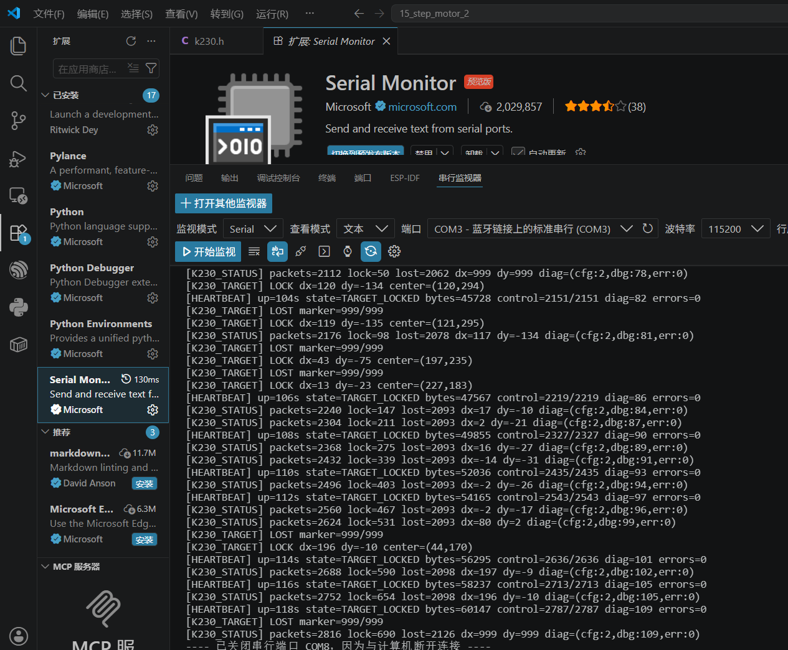

# VS Code 串口调试教程（115200）

本教程用于在 MSPM0 云台测试固件启动后，通过 VS Code 查看串口日志，判断主控是否运行、K230 数据是否到达，以及目标当前处于锁定还是丢失状态。

> **不要混淆波特率：** 嘉立创网页 BSL **烧录固件时使用默认 9600**；固件烧录完成并正常运行后，VS Code **串口调试使用 115200**。

## 1. 安装 Microsoft Serial Monitor

1. 打开 Visual Studio Code。
2. 按 `Ctrl+Shift+X` 打开“扩展”。
3. 搜索 `Serial Monitor`。
4. 选择发布者为 **Microsoft**、带 Microsoft 验证标记的扩展。
5. 点击“安装”。

扩展信息：

- 名称：`Serial Monitor`
- 发布者：Microsoft
- 扩展 ID：`ms-vscode.vscode-serial-monitor`
- 官方页面：<https://marketplace.visualstudio.com/items?itemName=ms-vscode.vscode-serial-monitor>

也可以在已经配置好 `code` 命令的终端中执行：

```powershell
code --install-extension ms-vscode.vscode-serial-monitor
```

## 2. 连接开发板并确认 COM 口

1. 用能够传输数据的 USB 线连接开发板和电脑。
2. 打开 Windows“设备管理器”中的“端口（COM 和 LPT）”。
3. 记下开发板对应的端口号，例如 `COM8`。
4. 如果无法判断，可拔下开发板，观察哪个 COM 口消失；重新插入后出现的端口通常就是开发板串口。

COM 号由电脑当前分配，可能随 USB 接口或驱动变化。**不要直接照抄截图中的 COM3，应选择自己电脑上实际对应开发板的 COM 口。**

## 3. 打开串行监视器

安装扩展后，可使用以下任一方式打开：

- 在 VS Code 底部面板点击“串行监视器（Serial Monitor）”。
- 通过菜单“终端”打开新终端，然后选择 Serial Monitor。
- 已有监视器时，可点击“打开其他监视器”创建新的串口会话。

如果底部面板没有显示，可重新加载 VS Code 窗口或确认扩展已启用。

## 4. 设置串口参数

在串行监视器顶部依次设置：

| 设置 | 选择值 |
| --- | --- |
| 监视模式 | `Serial` |
| 查看模式 | `文本` |
| 端口 | 开发板对应的实际 COM 口 |
| 波特率 | `115200` |
| 数据位 | `8` |
| 校验位 | `None`（无校验） |
| 停止位 | `1` |

接收日志时行尾设置通常不影响显示；如果需要向设备发送命令，应再根据设备协议选择 `None`、`LF`、`CR` 或 `CRLF`。

## 5. 开始调试

1. 确认网页烧录器、串口助手和 CCS 串口终端均已断开同一个 COM 口。
2. 点击 **“开始监视”**。
3. 按一下开发板 `RST`，让启动日志从头输出。
4. 观察监视器是否持续收到文本。
5. 调试结束后点击“停止监视”，释放 COM 口，再使用其他烧录或串口工具。



> 截图用于展示扩展和参数位置。截图中的端口仅为当时电脑环境示例，实际使用时请选择开发板对应 COM 口。

## 6. 常见日志含义

测试固件正常运行时可能看到以下类型的输出：

- `[HEARTBEAT]`：主控仍在运行；其中通常包含运行时间、状态、接收字节数和错误数量。
- `[K230_STATUS]`：K230 通信统计，例如数据包数量、锁定次数、丢失次数以及当前 `dx/dy`。
- `[K230_TARGET] LOCK`：当前收到有效目标，后面会显示目标误差或中心坐标。
- `[K230_TARGET] LOST`：当前目标丢失。
- `dx=999`、`dy=999` 或 `marker=999/999`：协议中的丢靶标记，不一定表示串口本身故障。

判断通信是否正常时，应同时观察：接收字节数是否增加、数据包计数是否增加、错误计数是否持续增长，以及 `LOCK/LOST` 是否符合当前画面。

## 7. 常见问题

### 无法打开 COM 口或提示端口被占用

- 关闭嘉立创网页烧录器的串口连接。
- 关闭其他串口助手、CCS 终端和重复打开的 Serial Monitor 会话。
- 点击“停止监视”后再切换端口。
- 拔插 USB，并重新确认设备管理器中的 COM 号。

### 已连接但没有任何输出

- 确认波特率为 `115200`，格式为 8N1。
- 确认选择的是开发板调试串口，而不是蓝牙虚拟串口或其他 USB 设备。
- 按一下开发板 `RST`。
- 确认芯片已退出 BSL 模式并启动应用；必要时在网页烧录器中点击“启动应用”。
- 检查 USB 线是否支持数据传输。

### 输出为乱码

- 最常见原因是波特率错误，应改为 `115200`。
- 检查数据位为 8、无校验、停止位为 1。
- 停止监视后重新打开端口，必要时复位开发板。

### 有心跳但没有 K230 数据

- 确认 K230/CanMV 正在运行 `K230_main_CHANGE_20260719_07.py`。
- 检查 K230 EXPORT 座 `IO9(TX)`、`IO10(RX)` 与云台串口是否交叉连接并共地。
- 确认 K230 端同样使用 `UART1`、`115200`、8N1。
- 查看 `[K230_STATUS]` 中接收字节数和错误计数，区分“无数据”和“收到但解析失败”。

## 8. 最短操作清单

1. VS Code 安装 Microsoft `Serial Monitor`。
2. USB 连接开发板并确认对应 COM 口。
3. 打开“串行监视器”。
4. 选择实际 COM 口，波特率设置为 `115200`。
5. 点击“开始监视”，再按一次 `RST`。
6. 查看 `[HEARTBEAT]`、`[K230_STATUS]` 和 `[K230_TARGET]` 日志。
7. 结束后点击“停止监视”，释放串口。
